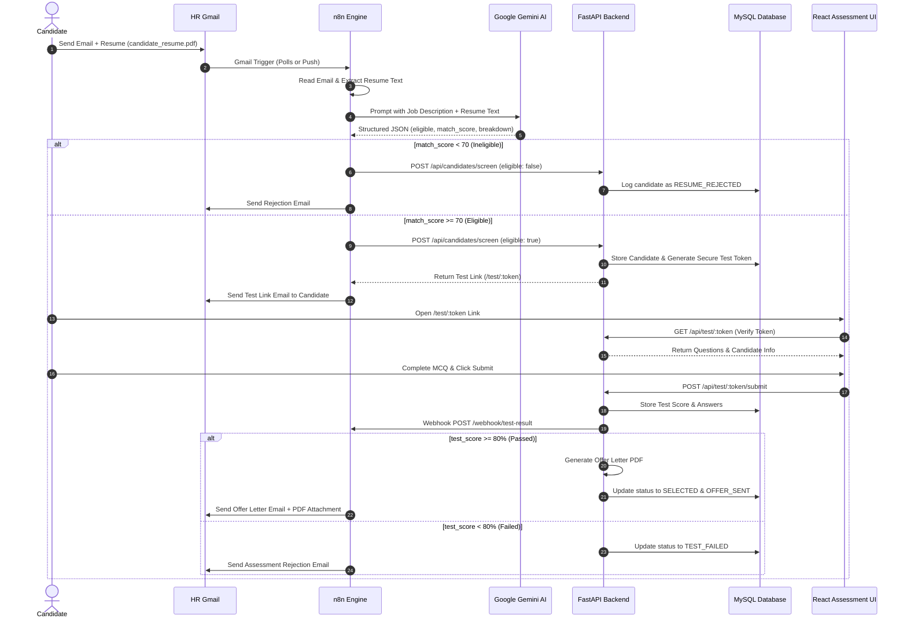

# Architecture Documentation — AI Recruitment Automation

This document outlines the system architecture, sequence flow, data schemas, and API contracts for the **AI-Powered Automated Recruitment System using n8n**.

---

## 1. High-Level Workflow Diagram

---

## 2. Key Components

### Workflow Automation (n8n)
- **Resume Screening Workflow**: Polls HR Gmail inbox, parses resume documents (PDF/DOCX/TXT), queries Google Gemini AI, and branches logic based on Gemini's match score ($\ge 70\%$).
- **Test Evaluation Workflow**: Receives test submission webhooks (`/webhook/test-result`), checks passing threshold ($\ge 80\%$), triggers PDF offer generation, and sends offer or rejection emails.

### FastAPI Backend
- Serves CRUD endpoints for Job Descriptions and Candidate applications.
- Manages secure candidate token generation and verification.
- Calculates test scores and updates MySQL database records.
- Dynamically generates styled PDF offer letters using ReportLab.

### React + Tailwind CSS Frontend
- **Candidate Assessment Platform**: Timed 30-minute online MCQ exam interface with token validation.
- **HR Admin Dashboard**: Visual real-time metric cards, candidate status pipeline, filter/search controls, and Gemini AI score analysis modals.

### MySQL Database
- Schema contains tables for `jobs`, `candidates`, `test_results`, and `workflow_logs`.
